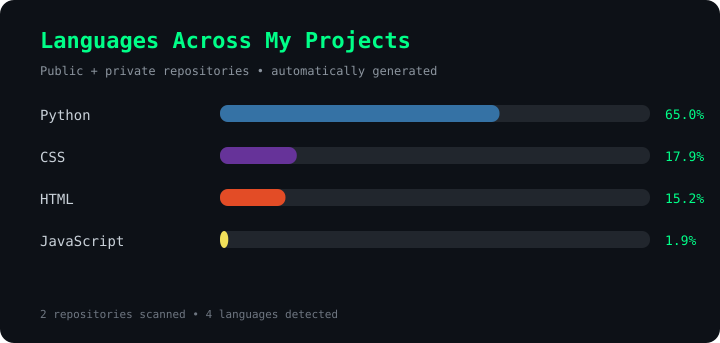

<div align="center">


</div>

---

```text
┌──(saqlainkalilinux㉿kali)-[~]
└─$ whoami

Muhammad Saqlain Shoukat

┌──(saqlainkalilinux㉿kali)-[~]
└─$ focus

Cybersecurity • Red Teaming • Web Security • Practical Attack Labs • CodingChatRoom

┌──(saqlainkalilinux㉿kali)-[~]
└─$ mission

Build → Break → Understand → Secure
```

## 🛡️ Cybersecurity Focus

```text
[+] Ethical Hacking
[+] Web Application Security
[+] Red Teaming & Adversary Simulation
[+] Authentication & Session Security
[+] Security Tool Development
[+] Vulnerability Research
[+] Practical Attack Demonstrations
[+] Linux-Based Security Research
[+] Controlled Cybersecurity Labs
```

> **My focus is not just learning how attacks work — I build controlled environments, reproduce security weaknesses, understand the underlying mechanisms, and study how they can be prevented.**

---

## ⚔️ Technical & Security Arsenal

### 💻 Programming Languages

<div align="center">


<br>


</div>

### 🌐 Web & APP Technologies

<div align="center">


</div>

### 🐧 Systems & Platforms

<div align="center">


</div>

### 🔧 Development & Version Control

<div align="center">


</div>

### 🛡️ Offensive Security & Testing

<div align="center">


<br>


<br>


</div>

### 🔐 Security Domains

<div align="center">


</div>

---

## 🧬 Languages Behind The Labs

<div align="center">



</div>

<p align="center">
  <sub>
    Automatically calculated across my public and private GitHub projects.
  </sub>
</p>

---

## 📡 GitHub Intelligence

<div align="center">


</div>

---

## 🎯 What I Build Here

```text
┌──────────────────────────────────────────────────────────┐
│                                                          │
│   Cybersecurity Labs                                     │
│        ↓                                                 │
│   Vulnerable Environments                                │
│        ↓                                                 │
│   Attack Simulations                                     │
│        ↓                                                 │
│   Technical Analysis                                     │
│        ↓                                                 │
│   Detection & Prevention                                 │
│                                                          │
└──────────────────────────────────────────────────────────┘
```

My repositories revolve around practical cybersecurity research and controlled demonstrations, including:

- Web application attack labs
- Authentication and session-security experiments
- Security testing utilities
- Custom cybersecurity tools
- Vulnerability demonstrations
- Red-team style simulations
- Educational security projects for **CodingChatRoom**

> All security demonstrations are created for **educational, research, and controlled-lab purposes**.

---

## 🎥 CodingChatRoom

<div align="center">

### Practical Cybersecurity. Real Labs. Technical Breakdown.

<a href="https://www.youtube.com/@CodingChatRoom">

</a>

<br><br>

Security concepts are explored through practical labs, custom-built applications, attack simulations, and technical explanations.

</div>

---

## 🌐 Connect With CodingChatRoom

<div align="center">

<a href="https://www.youtube.com/@CodingChatRoom">

</a>

<a href="https://www.instagram.com/codingchatroom.official">

</a>

<br><br>

<a href="https://www.instagram.com/codingchatroom.support">

</a>

<a href="https://www.whatsapp.com/channel/0029VaNl4PeHbFVGIeQDcD0H">

</a>

</div>

---

<div align="center">

```text
> ACCESS GRANTED

> SYSTEM: ONLINE
> ENVIRONMENT: KALI LINUX
> MODE: CYBERSECURITY RESEARCH
> STATUS: ALWAYS LEARNING
```

### `Think like an attacker. Build like a developer. Defend like a professional.`


</div>
